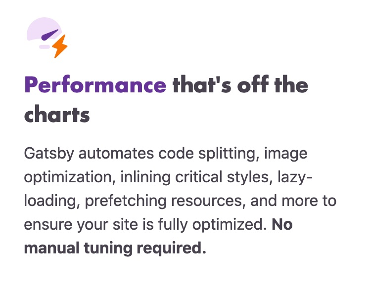
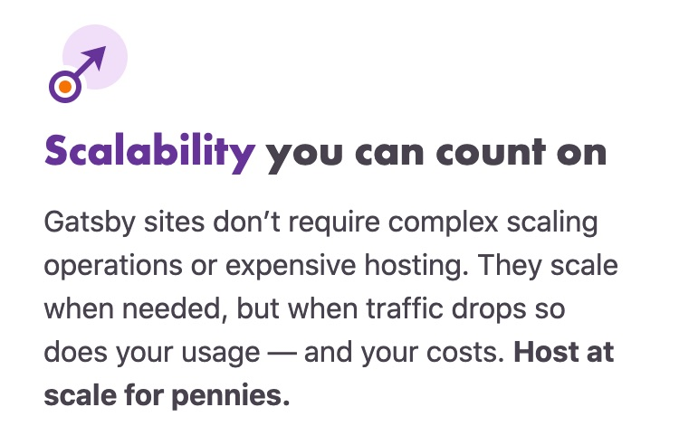
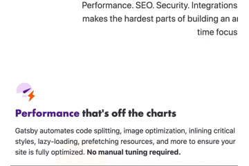

# 人工知能翻訳サービス DeepLのすすめ

[DeepL](https://www.deepl.com/ja/translator)という翻訳サービスはご存知ですか？翻訳の品質がすごいんです。

私は今までGoogle翻訳しか使っておらず、DeepLの翻訳品質の高さに驚いたのでご紹介します。

## DeepLとは

ディープエルと読みます。人工知能を活用した機械翻訳のサービスを提供するドイツの企業です。翻訳もニューラルネットワークの力でここまで進化するんですね。

>DeepLは、人工知能を活用し、世界に存在する言語の壁を取り払うことを目指すドイツ企業です。

https://www.deepl.com/press.html

近い将来に言葉の壁がないコミュニケーションを取れる未来が見えてきましたね。

## DeepLとGoogle翻訳の比較

翻訳といえば、Google翻訳だと思っていました。~~その昔は翻訳といえばエキサイト先生にお任せしてました。~~

今回はGatsby.jsの[Webページ](https://www.gatsbyjs.com/)翻訳を例に両者を比較して、DeepLがいかに優れているかを感じてもらいたいと思います。


```:Google翻訳
ウェブの最も難しい部分をシンプルにしました。
パフォーマンス。 SEO。安全。統合。アクセシビリティ。私たちはあなたのためにそれをカバーしています。 Gatsbyは、すばらしいデジタルエクスペリエンスを構築する上で最も難しい部分をシンプルにし、ビジネスに集中する時間を増やします。
```

```:DeepL
Webの難しい部分を、シンプルに。
パフォーマンスSEO対策。セキュリティ。統合。アクセシビリティ。私たちは、すべてをカバーします。ギャツビーは、素晴らしいデジタル体験を構築するための最も困難な部分をシンプルにし、その分ビジネスに集中する時間を増やします。
```

素晴らしい翻訳です。Google翻訳も理解はできるが・・・、読みづらく理解しづらいです。



```:Google翻訳
チャートから外れたパフォーマンス
Gatsbyは、コード分割、画像の最適化、重要なスタイルのインライン化、遅延読み込み、リソースのプリフェッチなどを自動化して、サイトが完全に最適化されるようにします。手動で調整する必要はありません。
```

```:DeepL
桁違いのパフォーマンス
コード分割、画像最適化、重要なスタイルのインライン化、レイジーローディング、リソースのプリフェッチなどを自動化し、サイトを完全に最適化することができます。手動でのチューニングは必要ありません。
```

DeepLは完璧な翻訳です。細かいニュアンスまで翻訳できていますね、一方、Google翻訳は・・・。



```:Google翻訳
信頼できるスケーラビリティ
Gatsbyサイトは、複雑なスケーリング操作や高価なホスティングを必要としません。必要に応じて拡張できますが、トラフィックが減少すると、使用量とコストも減少します。ペニーのために大規模にホストします。
```

```:DeepL
信頼できるスケーラビリティ
ギャツビーサイトは、複雑なスケーリング操作や高価なホスティングを必要としません。必要なときに必要なだけ拡張でき、トラフィックが減少すれば、使用量もコストも減少します。わずかな費用で大規模なホスティングが可能です。
```

完璧な翻訳です。一方、Google翻訳は、ペニー。

## ブラウザ拡張

Chrome用の拡張機能が提供されています。



https://chrome.google.com/webstore/detail/deepl-translate-beta-vers/cofdbpoegempjloogbagkncekinflcnj?hl=ja

---

私たちが翻訳したいものは、エラーの解消方法・新しい技術・リリースの内容など、まだ知らないことばかりです。ただでさえわからないものを、わかりにくい翻訳で読み進めるというのは辛いものがあります。

品質の高い機械翻訳サービスを活用して、良いプロダクトを生み出して、社会を便利にしていきたいです。