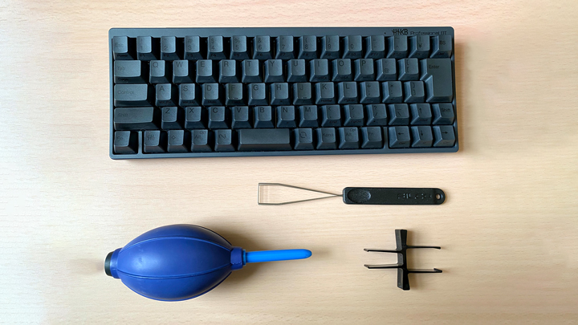
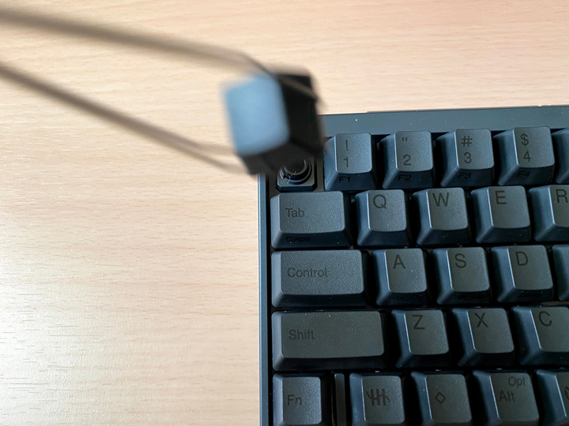
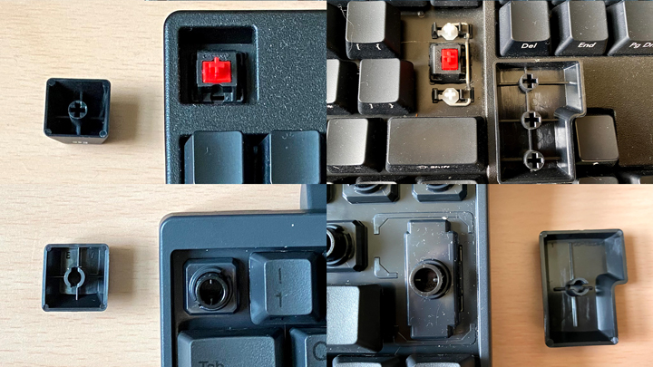
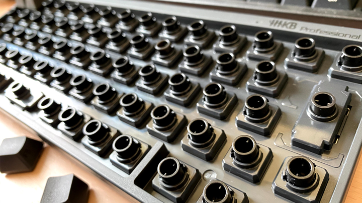
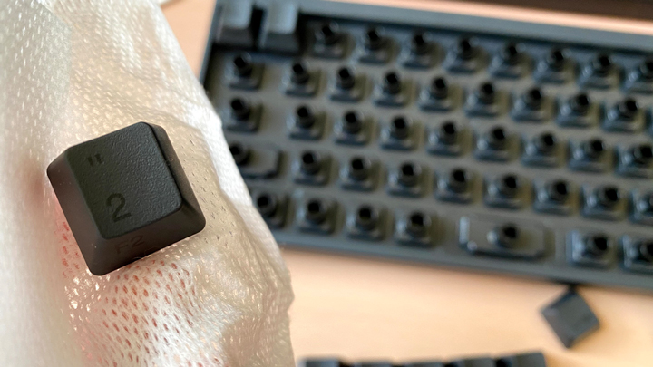
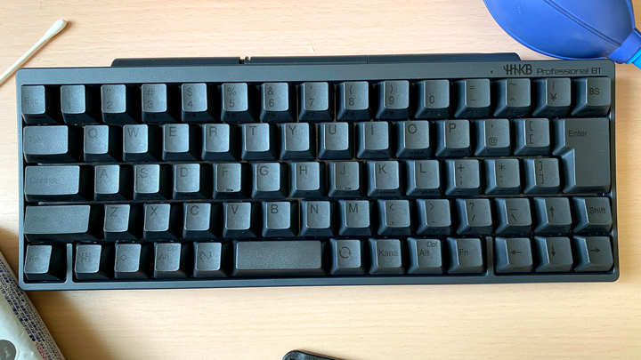

# キーボードのホコリぜんぶ抜く

**動作を保証するものではありません。作業は自己責任でお願いいたします。
**

## 準備するもの

* キーボード（お好きなメカニカルキーボード）
* [キープラー（1つ持っておくと便利）](https://www.amazon.co.jp/s?k=%E3%82%AD%E3%83%BC%E3%83%97%E3%83%A9%E3%83%BC&__mk_ja_JP=%E3%82%AB%E3%82%BF%E3%82%AB%E3%83%8A&ref=nb_sb_noss)
* ブロアー（ダイソーで買えます）
* アルコールティッシュ

## 手順

1. キーキャップを抜く
2. ブロワーでシュポシュポする
3. キーキャップを水洗いする
4. キーキャップをはめる

### キーキャップを抜く

最初にキーボードの写真を取ります。この写真は最後にキーキャップをはめ込むときに使います。

抜いていきます。

#### 部品をなくさないように注意する

キースイッチとキーキャップというのは凹凸で結合されています。ただし、エンターキーやスペースキーのような大きなキーに関してはそれ以外の部品がついていることもあるので、外す際になくさないように気を付けましょう。

*赤軸のキーボードには針金のような部品がついている（FILCO Majestouch）*

### ブロワーでシュポシュポする

キーを外し終わったら、ブロワーで埃がなくなるまでシュポシュポします。手の握力がなくなると思いますが、ここがメインの作業なので頑張りましょう。

かなりきれいになりました。
購入は1年前ですが、使用していないときは引き出し保管にしていたということもあってかなりきれいです。普段から、管理に気を使っていればメンテナンスも楽になります。コーディングと同じですね。

長く愛用されている方や初メンテの方は、スイッチとスイッチの隙間に、ホコリ・汚れ・ポテチの欠片などしつこい汚れもあるのではないでしょうか？どうしても気になる汚れがある場合は綿棒や濡れティッシュで丁寧にふき取りましょう。

### キーキャップを水洗いする

ボウルに入れて、ガシャガシャ水洗いしたい気持ちもわかるのですが、キー同士がぶつかりあい傷つけてしまいます。そのうえ印字がかすれてしまうことも。
面倒ですが1つずつ水洗いするか、アルコールティッシュで拭くのをオススメします。

水洗いした場合は、しっかり乾かしましょう。

あとは、最初に撮影した写真を見ながらキーをはめ込んで完成です。

## まとめ

ご苦労様でした！随分ときれいになりました。今年もよろしくお願いします！

途中でも話しましたが、キーボードの管理を丁寧に行っていれば、メンテナンスも簡単でキーボードも長持ちします。これを機に、キーボードの保管場所や定期的なメンテナンスも行ってあげてください。