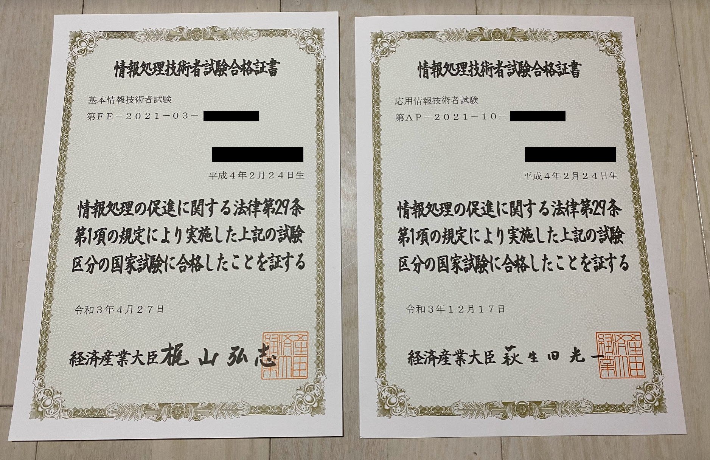
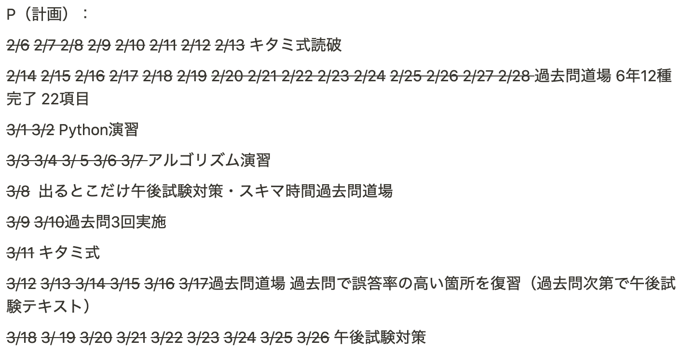
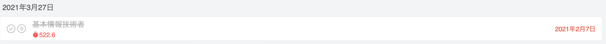
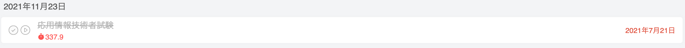

# 基本情報と応用情報の勉強方法

2021年、2つの試験に合格することができました。

# 受験のきっかけ

プログラム・設計・開発手法のことを学んでいくなかで、情報の基礎知識が足りないと感じはじめました。

それも当たり前のことで、学生時代は情報のことを専門的に学んでいませんでした。前職の仕事をはじめてからはハードウェアのことだけで、ソフトウェアのことはまったく知ることがありませんでした。

基礎固めを兼ねて国家資格である基本情報技術者試験を受験しようと思ったのがきっかけです。

# 基本情報技術者試験は受けるべきか

基礎知識が足りていない・基礎固めをしたいと感じる人は受けるべきです。内容は素晴らしい試験です。受験勉強を通して、業務に必要な基礎知識を身につけられるので、本質的な勉強ができます。

受けるべきでない・・・かもしれない人は、資格が転職や就職の武器になると考えている人です。武器としてはそんなに強くない上に、それなりに試験難易度も高いです。武器としてはコスパは悪いです。

# 勉強方法

ここでは私が実践した勉強方法を紹介します。

## 勉強期間

1か月半で詰め込みました。
フルタイムで働きながらだと、長期戦になると心も身体も辛いです。

## 計画立案

1か月半で何をするかを計画を立てます。

勉強範囲はかなり広いです。あらかじめ計画を立てておくことで、進捗管理ができます。
焦る時に焦り、順調な時は安心してゆったりできるので、精神的にいいです。

## 勉強時間管理

[ポモドーロタイマー](https://www.sensei.biz/pomodoro_technic/)を使います。

ポモドーロタイマーとは、25分のタイマーを1ポモドーロとして計算する時間管理メソッドです。

- 集中力アップ
- 勉強のきっかけ
- 休憩時間管理

など、勉強を効率よく進めるようになる補助ツールです。iOSアプリやWebツールなど、さまざまなプラットフォームで提供されています。

私はApple製品を使っているのでFocus To-Doというアプリを使用しています。

https://apps.apple.com/jp/app/focus-to-do-%E3%83%9D%E3%83%A2%E3%83%89%E3%83%BC%E3%83%AD%E6%8A%80%E8%A1%93-%E3%82%BF%E3%82%B9%E3%82%AF%E7%AE%A1%E7%90%86/id966057213

それぞれの試験に消費したポモドーロは以下の通りです。

*基本情報技術者試験 25分×522.6 = 約217.75時間*

*応用情報技術者試験 25分×337.9 = 約110.8時間*

# 勉強内容（基本情報）

午前試験と午後試験に分かれており、午後試験が難しいです。力の入れ具合は午前試験3・午後試験7くらいの気持ちで勉強してください。

## 午前試験

午前試験は8割以上が過去問から出題されるので簡単です。しかし、試験に受かるための勉強を目的としていないのでしっかりと学ぶ方法を実践しました。

### 北見式（7日間）

通しで2周する。解説がイラスト付きでとてもわかりやすいです。分厚いですが、イラスト分もあるので意外とスラスラと読めます。

https://amzn.to/33lUEcA

### 過去問道場（7日間）

過去5年分をやりこむ。最初は、一問ずつ紙とペンを用意して解けるようになってください。
何度も答えを覚えるくらいまでになれば午前試験はバッチリです。

通勤時間が長い人は、電車でスマホから。長風呂をするかたはお風呂でスマホから。隙間時間は過去問道場で鍛えてください。

https://www.fe-siken.com/fekakomon.php

## 午後試験

午後試験は午前試験と違って、毎年新しい問題が出題されるので難易度が高いです。
午前試験の合格率が60%くらいで午後が20~30%だったと思います。

午前試験の内容をしっかり勉強しておくことで、午後試験に必要な知識を補充できます。
午後試験の勉強方法も基本的には、過去問をひたすら回答していくことになります。

### 出るとこだけ（7日間）

少し古くなっているので、立ち読みしてみてわかりにくそうだったら他のテキストを選んだ方がいいかもしれません。
試験の出題傾向や科目選択の方法が第1章に書かれているので、そこだけでも立ち読みで読んで欲しいです。

https://amzn.to/3JYwhTq

### アルゴリズム（7日間）

難しいので7日以上みっちりやってほしいです。実務経験がある方なら、時間をかければ回答できます。過去問を解くことで回答スピードを上げることができるので、是非実践してください。

https://amzn.to/3f5TiFF

### プログラミングで選択した科目のテキスト

私はPythonを選択しました。Pythonの実務経験はなかったですが、アルゴリズムと同じで時間をかければ回答できます。

https://amzn.to/3HKq77k

## 残りの時間は過去問道場

午前試験で間違いの多かった問題や午後試験の過去問をやっていきましょう。

# 勉強内容（応用情報）

応用情報は基本情報に毛が生えたレベルです。毛が生えたと言っても、午後試験が記述式になるので、過去問のやりこみで想像力を上げることが重要です。

## 午前試験

基本情報と同じです。応用情報でも北見式は存在しますが、基本情報と内容がほとんど変わらないので私は使用していません。

### 過去問道場

をやりこむ。三段になるくらいまでやり込めば安心して大丈夫です。
基本情報で経験済みだと思うので、大丈夫だと思ったら午後試験の勉強に移行してください。

https://www.ap-siken.com/apkakomon.php

## 午後試験

問題を覚えても意味はないので、考え方を覚えてください。
と言われても難しいと思うので、過去問をひたすら回答していくというのが効率の良い勉強方法になります。

### 重点対策

全分野一問くらいやってみてください。そうすると、得意な問題と苦手な問題がわかるはずです。
得意分野を時間の許すかぎり周回してください。

https://amzn.to/3GbZvvC

### 過去問道場午後試験

重点対策を覚えてしまったら意味も無くなってしまうので、過去問道場でまだやっていない過去問を回答します。

---

短時間での勉強になります。勉強範囲もとても広いです。つまり、難しいことへの挑戦になります。
いくらやっても自信がつかないかもしれませんが、過去問と自分を信じて最後までやり切ってください。
試験本番は、一問でも多く回答できるように最後まで絶対に諦めないでください！