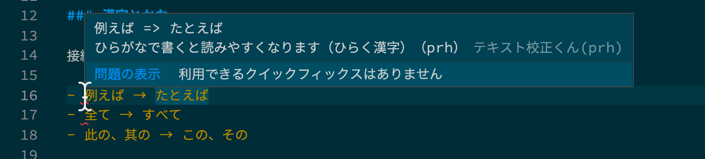

# 読みやすい文章をかく

エンジニアの仕事はプログラミングだけではありません。ドキュメントやガイドラインなど、意外と日本語の文章を書かなければいけないことが多いです。そのため、文章を書くときに気をつけるべきポイントをまとめておきました。

## 大切なこと

文章の目的は、「あなたの考え方を読者に伝えること」です。そして、そのために「読者のことを考える」ことが大切です。
これから記述するさまざまなポイントは、「読者のことを考える」という原則を具体化したものです。

[$card](https://amzn.to/3Hg1K1p)

### 漢字とかな

接続詞・副詞・指示語はひらがなで書きます。

- 例えば → たとえば
- 全て → すべて
- 此の、其の → この、その

#### 「とき・こと・もの」

- 〜する時 → 〜するとき
- 〜する事 → 〜すること
- 〜する物 → 〜するもの

たとえば、「〜する時、〜になる。」という文における「時」は、時間を表していないのでひらがなを使います。

### アラビア数字と漢数字

nに置き換えられる数字はアラビア数字を使います。

- 1人のエンジニア
- 2枚の指示書
- 100回以上のエラー

nに置き換えられない数字や慣用句は漢数字を使います。

- 一人きりで仕事をしているエンジニア
- 二の句が継げない
- 明日の百より今日の五十

### 半角と全角

英数字を書く時は、半角を使います。

- ｈｔｔｐ：／／ｅｘａｍｐｌｅ．ｃｏｍ → http://example.com

### 記号

文中に登場する記号についてまとめます。

#### 句読点

「、。」「，．」「,。」など、句読点は種類が多いですが、句点・読点それぞれ1種類に統一します。

#### 疑問符

疑問を表す「〜ですか」の後ろには疑問符をつける必要はありません。

#### カギカッコ

カギカッコ（「」）は、短い引用に使用します。二重カギカッコ（『』）は書名の引用に使用します。

- David ThomasとAndrew Huntは、『達人プログラマー』で、「DRY原則」を定義した。

#### 列挙

列挙の順序を入れ替えてもいい時は、ナカグロ（・）を使います。順序を入れ替えてはいけない時は、読点（、）やカンマ（，）を使います。

- 信号は青・黄・赤の順に点灯します。 → 信号は青、黄、赤の順に点灯します。

### 書き言葉と話し言葉

軽い読み物では、話し言葉を使いますが、ドキュメントなど堅い文章では書き言葉を使います。

- だって → なぜなら
- じゃないか → ではないか
- けど・だけど → しかし・だが
- なので → よって・ゆえに

### 文は短く

文が長いと読みづらくなります。1つの文で複数の主張をしてしまうからです。

**悪い例**

JavaScriptは実行時にデータ型を決める動的型付け言語であるのに対して、TypeScriptはあらかじめ型定義をする静的型付け言語です。

**改善例**

JavaScriptは実行時にデータ型を決める動的型付け言語です。それに対して、TypeScriptはあらかじめ型を定義する静的型付け言語です。

#### 長い文を複数の文に分ける

文が長くなってしまった時は、短くしてみると改善する場合があります。

- 〜であるが、〜である。 → 〜である。しかし、〜である。
- 〜〜であり、〜である。 → 〜である。また、〜である。
- 〜でだから、〜である。 → 〜である。よって、〜である。
- 〜のに対し、〜である。 → 〜である。これに対し、〜である。
- 〜で、〜で、〜である。 → まず、〜である。次に、〜である。最後に、〜である。

### 文を明確にする

文は明確に書きます。

**悪い例**

TypeScriptは、万人に勧められるものではないかもしれない。

**改善例**

TypeScriptは、開発者体験とプロダクト品質を向上させる。しかし、プログラミング初学者にはオススメできない。

不明確な文になった場合は、その理由の分析不足の可能性があります。
「オススメできない場合はどんな場合」などのように分析を進めることで、主張の明確な文になります。

#### 不明確な文になってしまう可能性のある表現

- 二重否定（〜なくはない・〜ないわけではない）
- 受け身（〜と思われる・〜と考えられる）
- ぼかし（たぶん・など・ともいえる・ちょっと・かもしれない）

### 「だ・である」と「です・ます」

1つの文章で、どちらを使うか統一します。
一般的には、説明文では「だ・である」を使います。読者に親しく話しかける文章では「です・ます」を使います。

## まとめ

私は、Webにある生の文章が読みづらいといつも感じていました。文章作法を知ったことで、わかりやすい文というのは、作法がいくつもあるということを知ることができました。
また、作法は一気に身に付けられる物でもないと感じました。これからは少しずつでもアウトプットに反映しつつ、伝える力を上げていきたいと思います。

## テキスト校正ツール

VS Codeの拡張でテキスト校正ツールがあります。VS Codeで文章を書いていれば、プログラムの構文エラーのようにエラーを出してくれるのでオススメです。

[$card](https://marketplace.visualstudio.com/items?itemName=ICS.japanese-proofreading)

## 参考

- [書籍『数学文章作法』](https://www.hyuki.com/mw/)
- [＜新版＞日本語の作文技術](https://publications.asahi.com/ecs/detail/?item_id=17593)
- [テキスト校正くん](https://marketplace.visualstudio.com/items?itemName=ICS.japanese-proofreading)