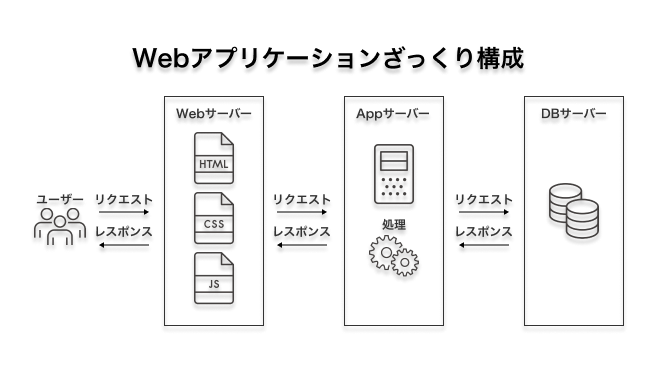

Webサービスの開発をしたいのに、サービスの全体像はまったくわからん

アーキテクチャ周りを勉強し始めるのは、はじめてのことなので色々と誤りを含む記事になるかもしれないのでご注意ください

下記、素晴らしい記事をもとに少しずつ勉強していく記事

[安く早く開発するための個人開発アーキテクチャ](https://zenn.dev/kazu777/articles/7b01cb8cec08fb)

## インフラ

### Google Cloud Platform（GCP）

最強のインフラが手に入れられる（Google様のサービス群と同じレベルらしい）

ここにフロントエンド・バックエンドのコードを配置する

ほかにも、データベースも使えるみたい

具体的には、ここら辺をこいつに担ってもらう

- Webサーバー（静的ページのデータのホスティング・htmlファイルとかをおくところ）
- アプリケーションサーバー（フロントとデータベース繋げてゴニョゴニョするとこ）
- データベースサーバー（実際にユーザーの情報とかあるとこ）

こんな感じ？（まだかなりあいまい）

[クラウド コンピューティング サービス  |  Google Cloud](https://cloud.google.com/?hl=ja)

### Terraform

Google Cloud Platformは、`Cloud SDK`を入れてぽちぽちしていく必要があるっぽい（まだ試してない）のだが、そのぽちぽちを自動化するためのツールらしい。

GCPのほかにも、AWSのインフラを構築するときにも使える。

インフラ構築を自動化すると環境構築手順書が必要なくなる！環境構築がコマンドひとつでできるのいいねってことでTerraformを使う。

## バックエンド

まったくわからん

### Hasura

まったくわからん

### Neon

まったくわからん

## フロントエンド

### JSフレームワーク

専門分野なので割愛

### Firebase Hosting

デプロイ先

Firebaseでホスティングできるんや

## まとめ

インフラとバックエンドはまったくわからん状態だったことが判明した。