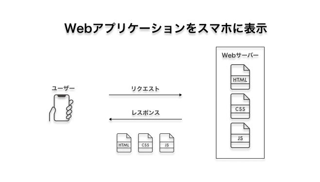
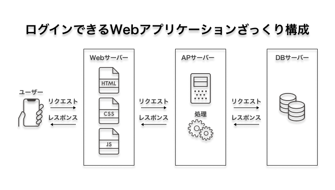
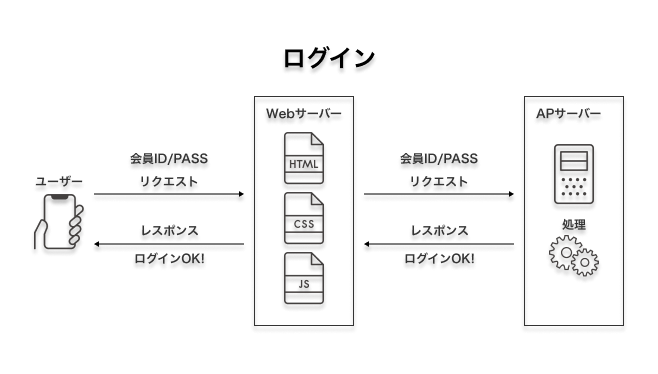
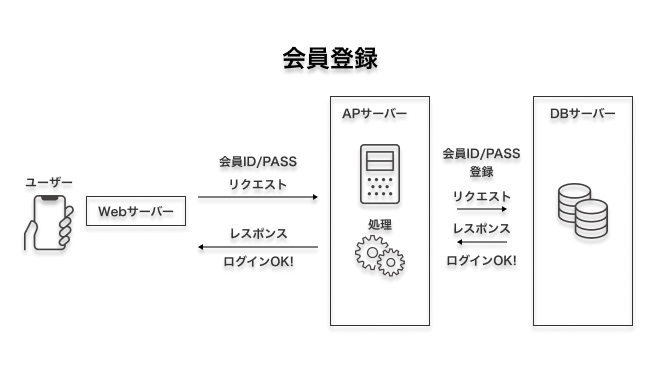
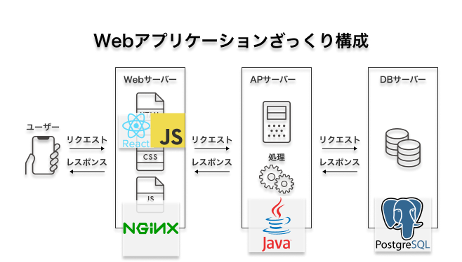

<notice type="info">メモ記事です（たぶん参考になりません）</notice>

<notice type="check">Webアプリケーションを取り巻く技術についてはわかるようになるはず</notice>

Webサービスの開発をしたいのに、サービスの全体像はまったくわからん

でもどこから調べればいいかわからない

なので、スマホにウェブアプリケーションを表示させるまでの流れで見ていこうと思う

アーキテクチャ周りを勉強しはじめるのは、はじめてのことなのでいろいろと誤りを含む記事になるかもしれないのでご注意ください

## スマホにWebアプリを表示するまで

手元から順番に説明したほうが分かりやすそう

まずはスマホにWebアプリを表示させるのはこんな流れ

1. URLにアクセスする（リクエスト）
2. Webサーバーがhtmlファイルを送り返す（レスポンス）
3. htmlファイルをブラウザが読み込んで画面表示する

めっちゃ簡単

このようなリクエストをもらって、htmlファイルやらを返すだけのサーバーが**Webサーバー**と呼ばれてる

でも、これじゃただのWebサイトだ

Webアプリとはいえない

## 会員登録・ログインができる

ここまでくるとややこしくなる

いろいろと省いてざっくり全体像を描くとこんな感じ（？）

サーバーが2つも増えた

焦らないでいい

必要なことは2つ

1. 会員登録・ログインをおこなう
2. ユーザーのID/PASSを保存する場所の確保

### ログイン

まず、1はAppサーバーでおこなう（アプリケーションサーバー？通常なんて呼ばれてるのかわからない）

スマホからの流れだとこんな感じ

みての通りで、Webサーバーはアプリケーションサーバーに情報を横流しするだけ

アプリケーションサーバーは、IDとPASSを登録したり、登録されている情報かどうかを判断してログインさせたりする

登録・ログインの判断はどうやっておこなうのだろう

### ユーザーのID/PASSを保存する

当然ながら僕たちが登録したIDやパスワードはどこかに保存されている

アプリケーションサーバーは保存先にID/PASSがあるかどうかを確認している

つまり会員登録時に保存先へ登録している

それが、データベースだ

通常DB（デービー）とか呼ばれている

ちなみに、このような構造がWeb3層アーキテクチャって呼ばれたりしてる

[Web3層アーキテクチャってなに？Alibaba Cloud, AWS, Azure, Google Cloud のWeb3層アーキテクチャを比べてみました｜クラウドテクノロジーブログ｜ソフトバンク](https://www.softbank.jp/biz/blog/cloud-technology/articles/202206/web-3-tier-architecture/)

## それぞれの技術

これまで、Webサーバー・アプリケーションサーバー・DBサーバーと話してきたけど、それぞれのサーバーでどんな技術が使われているのだろうか

ここからは全然詳しくないのでご注意を

サーバーというくらいだから、それぞれOSがあってそこでアプリケーションが動いている

### OSについて

サーバーって呼んでもそれぞれパソコンなので、OSが必要

サーバーのOSは通常のWindowやmacOSと異なって、主要なOSが存在する

大きく分けて2種類

- Windows系
- **UNIX系**

でも、たいていのサーバーはUNIX系だと思われる（**無料のため**）のでその前提で進める

（前職で扱ってた業務用機器のサーバーOSはWindowsServerだった記憶）

### Webサーバー

主なアプリケーションはこの2種類

- Nginx（エンジンエックス）
- Apache（アパッチ）

それぞれ特徴があるみたいだ

> Nginxを選択する場合
>
> 負荷が高く、スケーラビリティが要求されるような場合
> 静的ページに同時多数のアクセスが想定されるような場合
>
> Apacheを選択する場合
>
> 負荷が低く、早期または簡易的なセットアップが必要な場合
> 同時アクセス数が小さく、単純にリクエスト数が多いような場合
> 
> 引用：[ApacheとNginxについて比較 - Qiita](https://qiita.com/kamihork/items/49e2a363da7d840a4149)

[5月Webサーバシェア、NginxとApacheが増加 | TECH+（テックプラス）](https://news.mynavi.jp/techplus/article/20220506-2338760/)

### アプリケーションサーバー

<notice type="alert">ここの内容めっちゃ不安</notice>

それぞれの言語でWebサーバーからの処理を実行する場所

Webサーバーのようにこれで決まりみたいなものがなさそう（たぶん）

言語や環境によってはあるみたい

たとえば、Java言語でアプリケーションサーバーを実装するなら、Apache Tomcatというものがあるらしい

[Webアプリケーションサーバとは？3層構成の仕組みと導入のメリット - システム開発のプロが発注成功を手助けする【発注ラウンジ】](https://hnavi.co.jp/knowledge/blog/web-application-server/)

数あるどのプログラミング言語を使うかによって構成の仕方が変わりそう

### DBサーバー

<notice type="alert">ここの内容もめっちゃ不安</notice>

DBサーバーに関しては、よく耳にするものがある

- Oracle Database
- MySQL
- PostgreSQL

Webサーバーと同じでどれもやれることは同じで、それぞれ得意不得意があるのだろう

## まとめ

以上を肉付していくとこんな感じ、ドンッ！

エンジニアになって3年も経つのに、アプリケーションサーバー以降のことをほとんど知らないの**やばい**と思ったのでいろいろ調べてみた

個人的にGo触ってみたかったり、SQLのパフォーマンスのことに興味があったり、興味は持っているので今年はいろいろ勉強していけたらいいなと思う

## 参考

- [Web3層アーキテクチャってなに？Alibaba Cloud, AWS, Azure, Google Cloud のWeb3層アーキテクチャを比べてみました｜クラウドテクノロジーブログ｜ソフトバンク](https://www.softbank.jp/biz/blog/cloud-technology/articles/202206/web-3-tier-architecture/)
- [ApacheとNginxについて比較 - Qiita](https://qiita.com/kamihork/items/49e2a363da7d840a4149)
- [5月Webサーバシェア、NginxとApacheが増加 | TECH+（テックプラス）](https://news.mynavi.jp/techplus/article/20220506-2338760/)
- [Webアプリケーションサーバとは？3層構成の仕組みと導入のメリット - システム開発のプロが発注成功を手助けする【発注ラウンジ】](https://hnavi.co.jp/knowledge/blog/web-application-server/)